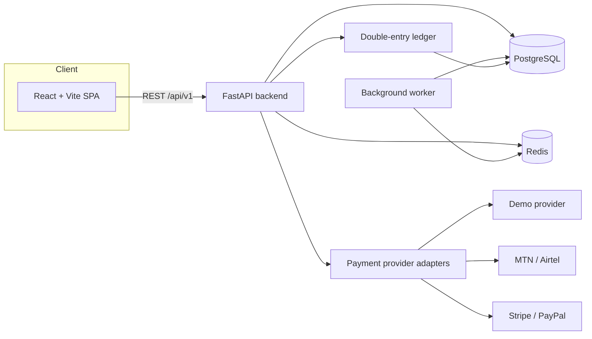
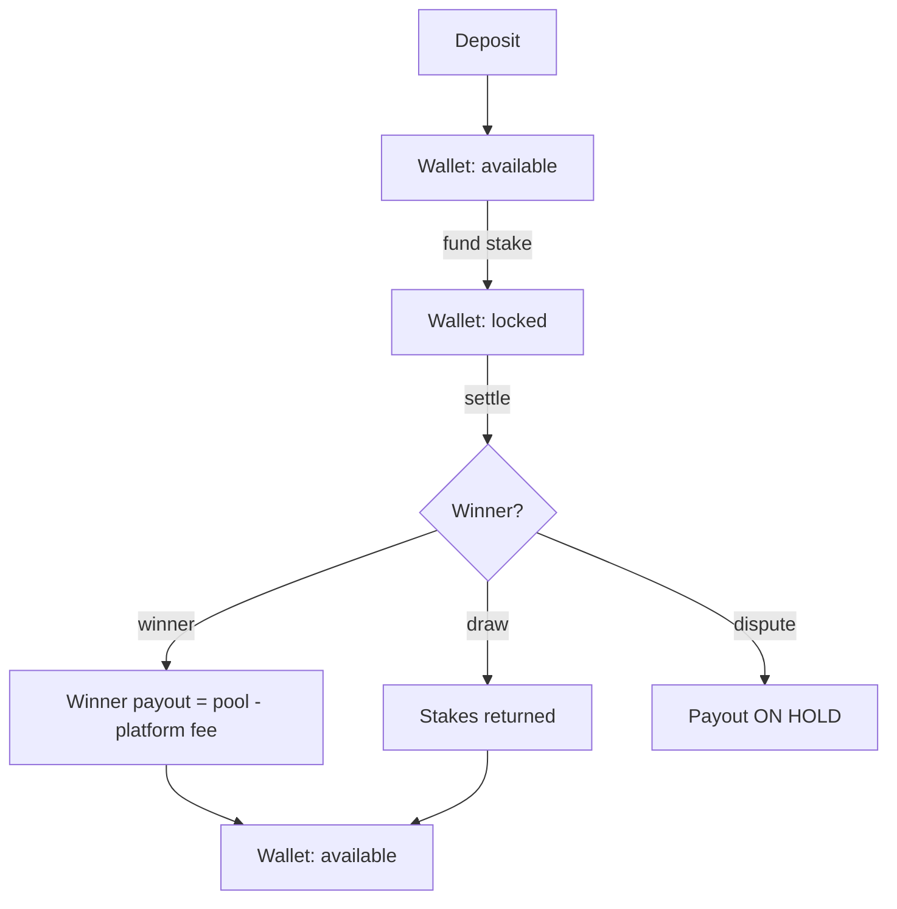

# Debate_Settler (DS)

A social debate and competitive challenge platform where people create debates,
challenge friends or other users, invite audiences, vote, settle verifiable
future events, and — where legally permitted and properly configured — attach
financial stakes through a transparent wallet.

DS combines a **social network + debate platform + competitive challenge arena +
transparent wallet**. The whole product is built around one rule: it is always
obvious

1. **What** exactly is being debated
2. **Who** decides the result
3. **When** it ends
4. **What happens** to your money

> Powered by VerseTechnologies

---

## Two ways to settle a debate

| Mode | Who decides | Use it when |
|------|-------------|-------------|
| **Local Debate** 🧑‍🤝‍🧑 | Real people watch and vote | No external source can decide (e.g. "which presentation was better?") |
| **Online Result Debate** 🌍 | A pre-agreed, verifiable source | An official result settles it (e.g. an official match result) |

For Online Result Debates the **settlement source and rule are locked before the
debate starts**. The system never searches the internet after the fact or guesses
a winner — if the source is unavailable or contradictory the debate goes
**Under Review**.

---

## Tech stack

**Frontend** — React 18 · TypeScript · Vite · React Router v6 · TanStack Query ·
Zustand · Axios · modern CSS (mobile-first, accessible).

**Backend** — Python · FastAPI · Pydantic v2 · async SQLAlchemy 2.0 · Alembic ·
background worker scheduler.

**Data / infra** — PostgreSQL (authoritative for money) · Redis (cache + rate
limiting) · Docker · Docker Compose.

**No required AI dependency.** Trending, recommendations and search use
traditional signals (engagement, votes, participants, recency, category
popularity). AI can be added later as an optional feature; the core app works
without it.

---

## Architecture



### Money flow (double-entry)



Money always uses `Decimal` / PostgreSQL `NUMERIC` — never floats. Every movement
is recorded as balanced ledger entries with a unique transaction reference, and
financial rows are **never deleted** (reversals/refunds instead).

---

## Project layout

```
Debate-Settler/
├── backend/
│   ├── app/
│   │   ├── api/v1/          # auth, debates, wallet, users, admin, misc routers
│   │   ├── core/            # config, database, redis, security, money, exceptions
│   │   ├── db/seed.py       # idempotent seed (categories, users, wallets, debates)
│   │   ├── models/          # SQLAlchemy models + enums
│   │   ├── payments/        # provider adapters (demo, MTN, Airtel, Stripe, PayPal)
│   │   ├── schemas/         # Pydantic request/response models
│   │   ├── services/        # auth, debate, wallet, ledger, notification, audit
│   │   ├── settlements/     # settlement engine (local votes + online results)
│   │   ├── workers/jobs.py  # scheduler: close debates, funding timeouts, payments
│   │   └── main.py          # FastAPI app
│   ├── migrations/          # Alembic
│   ├── tests/               # pytest (SQLite in-memory)
│   ├── requirements.txt
│   └── Dockerfile
├── frontend/
│   ├── src/
│   │   ├── api/client.ts    # typed Axios API surface
│   │   ├── components/      # Splash, DebateCard, StatusBadge, ui primitives
│   │   ├── layouts/         # DashboardLayout (header, sidebar, mobile nav)
│   │   ├── pages/           # dashboard, discover, create, debate, wallet, admin…
│   │   ├── store/auth.ts    # Zustand auth store
│   │   ├── types/           # shared TS types mirroring the backend
│   │   └── utils/format.ts  # money/date/status formatting
│   ├── nginx.conf
│   └── Dockerfile
├── docker-compose.yml
├── .env.example
└── README.md
```

---

## Quick start with Docker

```bash
cp .env.example .env        # then edit secrets
docker compose up --build
```

- Frontend: http://localhost:5173
- Backend API: http://localhost:8000 (health: `/health`, docs: `/docs`)
- The backend container runs `alembic upgrade head` before serving.

To load demo data (categories, users, wallets, sample debates):

```bash
docker compose exec backend python -m app.db.seed
```

Seeded logins (password `Password123!`):

| Username | Role |
|----------|------|
| `ambrose` | admin |
| `grace` | user |
| `ivan` | moderator |

> Seed wallets are funded with clearly-marked **DEMO** balances. Demo mode never
> moves real money.

---

## Manual (local) setup

### Backend

```bash
cd backend
python -m venv .venv && source .venv/bin/activate   # Windows: .venv\Scripts\activate
pip install -r requirements.txt
cp ../.env.example .env                              # edit as needed
alembic upgrade head
python -m app.db.seed          # optional demo data
uvicorn app.main:app --reload --port 8000
```

Run the background worker in a second terminal:

```bash
python -m app.workers.jobs
```

### Frontend

```bash
cd frontend
npm install
npm run dev          # http://localhost:5173 (proxies /api to :8000)
```

---

## Tests

```bash
cd backend
pytest            # uses SQLite in-memory + demo payment mode
```

```bash
cd frontend
npx tsc -b        # typecheck
npm run build     # production build
```

---

## Configuration

All configuration is via environment variables — see [`.env.example`](.env.example).
Nothing secret is hard-coded. Key groups:

- **Security** — `SECRET_KEY`, `JWT_SECRET`, token lifetimes, CORS, rate limits,
  account lockout.
- **Compliance flags** — `ENABLE_REAL_MONEY`, `ENABLE_LOCAL_MONEY`,
  `ENABLE_WITHDRAWALS`, `REQUIRE_KYC`, `REQUIRE_AGE_VERIFICATION` (all default
  **false**), `ENABLE_GAMES` (default true, free play only).
- **Financial** — `PLATFORM_FEE_PERCENT` (configurable, disclosed before any
  commitment), `WITHDRAWAL_FEE_PERCENT`, `FUNDING_TIMEOUT_MINUTES`,
  `DEFAULT_CURRENCY`.
- **Payments** — `PAYMENT_MODE` (`demo` | `live`) and per-provider credentials.

---

## Security & compliance principles

- The **backend is the source of truth** for balances, stakes, fees, votes,
  winners and deadlines. The frontend is never trusted for money or results.
- **Never** fake a payment success; a request is only marked complete once the
  provider confirms it. Webhooks are idempotent (no double-credit).
- Financial features are gated by jurisdiction/compliance flags and only enabled
  where legally permitted and properly configured. The app never claims to be
  "fully licensed".
- Passwords are hashed (bcrypt); secrets, tokens and DB ids are never exposed in
  the frontend or public URLs.
- Votes are authenticated, de-duplicated and rate-limited; the server clock is
  authoritative for voting windows.
- Admin/financial actions are recorded in a **hash-chained audit log**.
- Users never see raw stack traces — errors return friendly, plain-English
  messages.

---

## License

Proprietary — © VerseTechnologies. All rights reserved.
