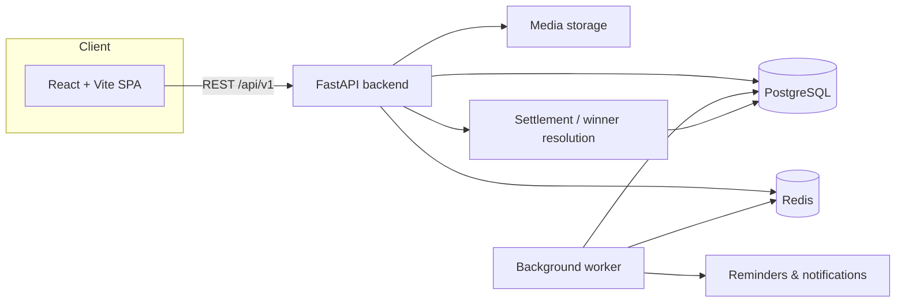

# Debate Settler

A **free** global social debate platform. People create a debate, invite an
opponent, agree on the rules, lock it, then invite an audience to watch and
vote. The result is decided by real people or a pre-agreed verifiable source —
never by money. There are no wallets, stakes, fees, deposits, withdrawals or
payment providers anywhere on the platform.

The whole product is built around one rule: it is always obvious

1. **What** exactly is being debated
2. **Who** decides the result
3. **When** it ends
4. **How** the result is reached

> Powered by VerseTechnologies

---

## Two ways to settle a debate

"Settle" here means **decide the winner** — no money is involved.

| Mode | Who decides | Use it when |
|------|-------------|-------------|
| **Local Debate** 🧑‍🤝‍🧑 | Real people watch and vote | No external source can decide (e.g. "which presentation was better?") |
| **Online Result Debate** 🌍 | A pre-agreed, verifiable source | An official result settles it (e.g. an official match result) |

For Online Result Debates the **settlement source and rule are locked before the
debate starts**. The system never searches the internet after the fact or guesses
a winner — if the source is unavailable or contradictory the debate goes
**Under Review**. AI never secretly decides a winner unless the locked rules
explicitly define an AI-judged debate.

---

## Tech stack

**Frontend** — React 18 · TypeScript · Vite · React Router v6 · TanStack Query ·
Zustand · Axios · modern CSS (mobile-first, accessible, dark/light/system theme).

**Backend** — Python · FastAPI · Pydantic v2 · async SQLAlchemy 2.0 · Alembic ·
background worker scheduler.

**Data / infra** — PostgreSQL (authoritative) · Redis (cache + rate limiting) ·
Docker · Docker Compose.

**No required AI dependency.** Trending, recommendations and search use
traditional signals (engagement, votes, participants, recency, category
popularity).

---

## Architecture


```mermaid
flowchart LR
  subgraph Client
    UI[React + Vite SPA]
  end
  UI -->|REST /api/v1| API[FastAPI backend]
  API --> PG[(PostgreSQL)]
  API --> RD[(Redis)]
  API --> MD[Media storage]
  WK[Background worker] --> PG
  WK --> RD
  WK --> NTF[Reminders & notifications]
  API --> STL[Settlement / winner resolution]
  STL --> PG
```

Debate results use authenticated, de-duplicated, rate-limited votes. The server
clock is authoritative for voting windows and deadlines.

---

## Project layout

```
Debate-Settler/
├── backend/
│   ├── app/
│   │   ├── api/v1/          # auth, debates, users, media, admin, misc routers
│   │   ├── core/            # config, database, redis, security, exceptions
│   │   ├── db/seed.py       # idempotent seed (categories, users, debates)
│   │   ├── models/          # SQLAlchemy models + enums (debate, media, comment…)
│   │   ├── schemas/         # Pydantic request/response models
│   │   ├── services/        # auth, debate, media, notification, audit
│   │   ├── settlements/     # winner resolution (local votes + online results)
│   │   ├── workers/jobs.py  # scheduler: close debates, reminders, notifications
│   │   └── main.py          # FastAPI app
│   ├── migrations/          # Alembic
│   ├── tests/               # pytest (SQLite in-memory)
│   ├── requirements.txt
│   └── Dockerfile
├── frontend/
│   ├── src/
│   │   ├── api/client.ts    # typed Axios API surface
│   │   ├── components/      # Splash, DebateCard, StatusBadge, ui primitives
│   │   ├── layouts/         # DashboardLayout (header, sidebar, mobile nav)
│   │   ├── pages/           # dashboard, discover, create, debate, profile, admin…
│   │   ├── store/auth.ts    # Zustand auth store
│   │   ├── types/           # shared TS types mirroring the backend
│   │   └── utils/format.ts  # date/status/timezone formatting
│   ├── nginx.conf
│   └── Dockerfile
├── docker-compose.yml
├── .env.example
└── README.md
```

---

## Quick start with Docker

```bash
cp .env.example .env        # then edit secrets
docker compose up --build
```

- Frontend: http://localhost:5173
- Backend API: http://localhost:8000 (health: `/health`, docs: `/docs`)
- The backend container runs `alembic upgrade head` before serving.

To load demo data (categories, users, sample debates):

```bash
docker compose exec backend python -m app.db.seed
```

Seeded logins (password `Password123!`):

| Username | Role |
|----------|------|
| `ambrose` | admin |
| `grace` | user |
| `ivan` | moderator |

---

## Manual (local) setup

### Backend

```bash
cd backend
python -m venv .venv && source .venv/bin/activate   # Windows: .venv\Scripts\activate
pip install -r requirements.txt
cp ../.env.example .env                              # edit as needed
alembic upgrade head
python -m app.db.seed          # optional demo data
uvicorn app.main:app --reload --port 8000
```

Run the background worker in a second terminal:

```bash
python -m app.workers.jobs
```

### Frontend

```bash
cd frontend
npm install
npm run dev          # http://localhost:5173 (proxies /api to :8000)
```

---

## Tests

```bash
cd backend
pytest            # uses SQLite in-memory
```

```bash
cd frontend
npx tsc -b        # typecheck
npm run build     # production build
```

---

## Configuration

All configuration is via environment variables — see [`.env.example`](.env.example).
Nothing secret is hard-coded. Key groups:

- **App** — `APP_NAME`, `APP_ENV`, `DEBUG`, `API_V1_PREFIX`, `FRONTEND_URL`, `BACKEND_URL`.
- **Database / cache** — `DATABASE_URL`, `SYNC_DATABASE_URL`, `REDIS_URL`, pool sizes.
- **Security** — `SECRET_KEY`, `JWT_SECRET`, token lifetimes, CORS, rate limits,
  account lockout.
- **Features** — `ENABLE_GAMES` (free play only).
- **Media** — `MEDIA_ROOT`, `MAX_MEDIA_UPLOAD_MB`, `MAX_IMAGE_UPLOAD_MB`,
  `MAX_VIDEO_SECONDS`, and the allowed image/video content-type lists.
- **Notifications** — `EMAIL_API_KEY`, `EMAIL_FROM`, `SMS_API_KEY`.

---

## Security & compliance principles

- The **backend is the source of truth** for debates, votes, winners and
  deadlines. The frontend is never trusted for results.
- Uploaded media is validated (content-type allowlist, size caps, image/video
  verification) with safe, generated filenames. Private uploads are never exposed
  publicly unless the debate itself is public.
- Passwords are hashed (bcrypt); secrets, tokens and DB ids are never exposed in
  the frontend or public URLs.
- Votes are authenticated, de-duplicated and rate-limited; the comment system is
  kept separate from the official voting system.
- Admin/moderation actions are recorded in a **hash-chained audit log**.
- Users never see raw stack traces — errors return friendly, plain-English
  messages.

---

## License

Proprietary — © VerseTechnologies. All rights reserved.
